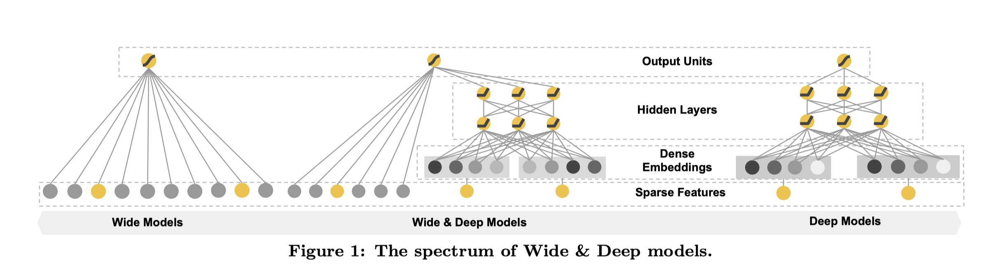

本文是2016年谷歌提出的Wide&Deep模型。如其说谷歌提出了一个具体的模型，不如说是给出了一个线性模型与深度学习模型结合共同学习的架构，为后来的混合模型抛砖引玉。因此WIde&Deep模型在工业界发挥着巨大的影响力。该模型主要由两部分组成：

1. Wide部分：通过线性模型来处理大量历史的行为特征，使模型具有“记忆能力”。但其通常依赖于更多的特征工程。
2. Deep部分：通过对稀疏特征的embedding进行学习，模型可以较好地推广到不可见的深度特征组合，让模型具有“泛化能力”。但如果数据过于稀疏，那么神经网络会过度泛化，即过拟合。

Wide&Deep模型结合Wide和Deep的优势，能够快速处理并记忆大量历史行为特征，并且具有强大的表达能力。

有关该模型的结构，首先我们对文中提到“记忆能力”和“泛化能力”进行解释。

## Memorization与Generalization


文中提到，推荐系统的挑战之一就是让模型同时拥有较强的“记忆能力”和“泛化能力”。对于“记忆”（memorization）和“泛化”（generalization），原文中的描述是：

> Memorization can be loosely defined as learning the frequent co-occurrence of items or features and exploiting the correlation available in the historical data. Generalization, on the other hand, is based on transitivity of correlation and explores new feature combinations that have never or rarely occurred in the past.

翻译一下可以理解为：

- **记忆能力：**模型直接学习并利用（**exploiting**）历史数据中物品或特征“贡献频率”的能力。
- **泛化能力：**基于特征传递的相关性，探索（**exploring**）过去从未或很少发生的新特征组合。

**「基于记忆的推荐」**是指直接学习并利用历史数据中物品或者特征的“共现频率”的能力的模型，例如常见的协同过滤、逻辑回归模型都是具有较强的“记忆能力”，原始数据往往可以直接影响推荐结果，类似于“如果点击A，就推荐B”的规则式推荐。**「基于泛化的推荐」**是模型传递特征的相关性进行推荐。对于传统的协同过滤存在着缺陷，处理稀疏向量能力弱。为了解决上述问题，矩阵分解被提出，来增强模型的泛化能力。矩阵分解引入了隐向量的结构，这使得数据稀少的用户或物品也能生成隐向量，从而获得有数据支撑的推荐得分。对于深度学习模型，通过对特征的自动组合，挖掘数据中的潜在模式，从而提高模型的泛化能力。

**讨论1：**上面关于记忆与泛化的描述，我们是否可以认为，存在一个用户与物品数量少，而流量【即用户与物品交互】过多的场景，那么基于记忆的推荐的性能不逊于基于泛化的推荐？在推荐精度相同的情况下，简单的推荐模型比复杂的深度学习模型效率更高，因此选择传统模型应该会更适合，也就一定程度上符合了奥卡姆剃刀原则。

## Wide & Deep



### Wide Component

Wide部分善于处理稀疏类的特征。该部分通常是由一个广义线性模型构成(如图1左）：
$$
y=\mathbf{w}^T\mathbf{x}+b
$$


其中特征$$\mathbf{x}=[x_1, x_2,...,x_d]$$由原生输入特征和特征变换构成（特征工程）。


#### cross-product transformation

其中文中提到过的特征变换为交叉乘积变换（cross-product transformation）：
$$
\phi_k(\mathbf{x})=\prod_{i=1}^dx_i^{c_{ki}}\ \ \ \ c_{ki}  \in \{0,1\}
$$
$$c_{ki}$$是一个布尔变量，当第$$i$$个特征属于第$$k$$个特征组合$$\phi_k$$时，$$c_{ki}$$值为1，否则为0。

例如文中提到对于特征组合"AND(gender=female, language=en)"，如果对应的特征“gender=female” 和“language=en”都符合，则对应的交叉积变换层结果才为1，否则为0。

**作用：**这能捕获两个二元特征之间的交互，并为广义线性模型添加非线性。


### Deep Component

该部分主要是一个Embedding+MLP的神经网络模型（如图1右）。大规模稀疏特征通过embedding转化为低维密集型特征。然后特征进行拼接输入到MLP中，挖掘藏在特征背后的数据模式。


### Joint Wide and Deep

Wide部分和Deep部分的输出进行加权求和作为最后的输出。模型的最终预测为：
$$
P(Y=1 \mid \mathbf{x})=\sigma\left(\mathbf{w}_{w i d e}^{T}[\mathbf{x}, \phi(\mathbf{x})]+\mathbf{w}_{d e e p}^{T} a^{\left(l_{f}\right)}+b\right)
$$
其中$$\sigma(\cdot)$$为sigmoid函数，$$\mathbf{w}_{wide},\mathbf{w}_{deep}$$分别是Wide部分和Deep部分的权重。

**讨论2：**值得注意的是文中Wide部分和Deep部分的优化器不相同。Wide部分采用基于L1正则的TTRL优化算法，Deep部分采用AdaGrad的优化算法。参考[1]，**FTRL with L1非常注重模型的稀疏性**，也就是说**W&D是想让Wide部分变得更加稀疏。**此处作者采用FTRL优化算法应该考虑了模型实际的应用背景，若对于普通的场景，或者说实验【一些公共数据集上】，是否有必要采用两个优化算法？看过一些复现代码，直接采用了单个优化器。


## Google Pay Recommender System

我觉得有必要提一下文中提到的应用背景---Google Pay。


以上是一个Google Pay推荐系统的结构。与一般的推荐系统不同的是，Google Pay是通过**检索**来实现推荐的**召回**，将大规模的App应用缩小到小规模（例如100）的相关应用。然后在通过用户特征、上下文特征、用户行为特征等来**建立推荐模型**，估计用户点击每个App的概率分数，按照分数进行**排序**，推荐Top K个App。

具体的Wide&Deep模型如下：


可以看到特征分为了连续型特征【年龄、已安装App数量，参与会话数量】和分类特征【用户人口属性特征、设备类型、已安装App、当前曝光App】。分类特征进行了Embedding操作，文中给出的embedding向量的隐藏单元为32。Deep部分使用了所有的特征，并进行拼接，然后通过了三层激活函数为ReLU的神经网络。而Wide部分，采用了稀疏特征已安装App和当前曝光App，使用这个组合特征的意图是想发现当前曝光app和用户安装app的关联关系，以此来直接影响最终的得分。因此回到上述关于Wide部分使用了带有L1正则化的FTRL的优化器，可能是因为两个id类特征向量进行组合，在维度爆炸的同时，会让原本已经非常稀疏的multihot特征向量，变得更加稀疏。因此采用FTRL过滤掉哪些稀疏特征是非常好的工程经验。最后再将两者进行结合【这里集合的是特征，而不是两部分预测的概率值】，输入到一个Logistic Loss层进行输出。


## 代码复现

### Tensorflow

Wide&Deep模型可以直接通过Tensorflow进行调用：

```python
tf.keras.experimental.WideDeepModel(
    linear_model, dnn_model, activation=None, **kwargs
)
```

```python
linear_model = LinearModel()
dnn_model = keras.Sequential([keras.layers.Dense(units=64),
                             keras.layers.Dense(units=1)])
combined_model = WideDeepModel(dnn_model, linear_model)
combined_model.compile(optimizer=['sgd', 'adam'], 'mse', ['mse'])
# define dnn_inputs and linear_inputs as separate numpy arrays or
# a single numpy array if dnn_inputs is same as linear_inputs.
combined_model.fit([dnn_inputs, linear_inputs], y, epochs)
```

可以看到，模型需要的的两个主要参数为线性模型和深度模型，并没有限制模型的结构，这也符合文章一开头说到的Wide&Deep是给我们提供了一个很好的推荐模型架构。并且模型中Wide部分和Deep部分训练的优化器是分开。我们再进一步查看WideDeepModel的主要源码：

```python
@keras_export('keras.experimental.WideDeepModel')
class WideDeepModel(training.Model):
  def __init__(self, linear_model, dnn_model, activation=None, **kwargs):
    """Create a Wide & Deep Model.

    Args:
      linear_model: a premade LinearModel, its output must match the output of
        the dnn model.
      dnn_model: a `tf.keras.Model`, its output must match the output of the
        linear model.
      activation: Activation function. Set it to None to maintain a linear
        activation.
      **kwargs: The keyword arguments that are passed on to BaseLayer.__init__.
        Allowed keyword arguments include `name`.
    """
    super(WideDeepModel, self).__init__(**kwargs)
    self.linear_model = linear_model
    self.dnn_model = dnn_model
    self.activation = activations.get(activation)

  def call(self, inputs):
    if not isinstance(inputs, (tuple, list)) or len(inputs) != 2:
      linear_inputs = dnn_inputs = inputs
    else:
      linear_inputs, dnn_inputs = inputs
    linear_output = self.linear_model(linear_inputs)
    dnn_output = self.dnn_model(dnn_inputs)
    output = .5 * (linear_output + dnn_output)
    if self.activation:
      return self.activation(output)
    return output
```

Wide和Deep部分的输入可以是相同的，并且重要的是最终的输出是Wide输出和Deep输出的平均【或者加入激活函数】。这与我们之前文中看到的模型构造是不同的。

因此我们不一定完全按照论文中给出的模型结构进行复现，因为文中是基于具体的应用场景进行搭建的，更该关注的是Wide部分和Deep部分结合的思想。


### 自己复现

由于之前复现过DIN代码，因此使用了与其同的推荐环境【亚马逊的电子商品数据集】，简单进行了复现。【反正能跑起来】

github地址：https://github.com/BlackSpaceGZY/Recommended-System


## 总结

Wide&Deep模型能够取得成功的关键在于：

1. 抓住了业务问题的本质特点，能够融合传统模型的记忆能力和深度学习模型泛化能力的优势；
2. 模型简单，比较容易在工程上实现、训练和上线，加速了在工业界的推广和应用。


## 参考

\[1\] [见微知著，你真的搞懂Google的Wide&Deep模型了吗？](https://zhuanlan.zhihu.com/p/142958834)

