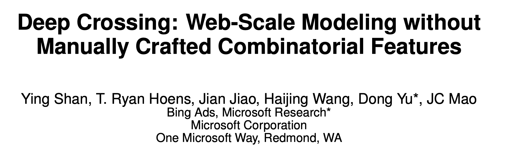
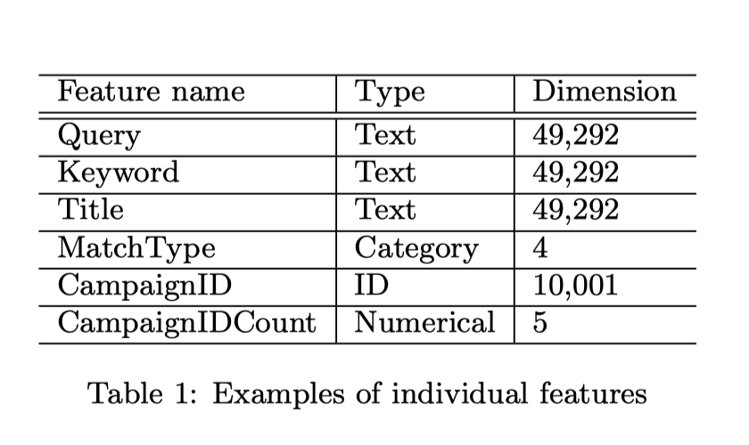
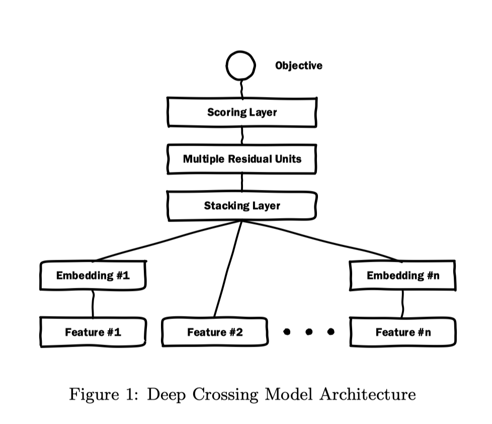
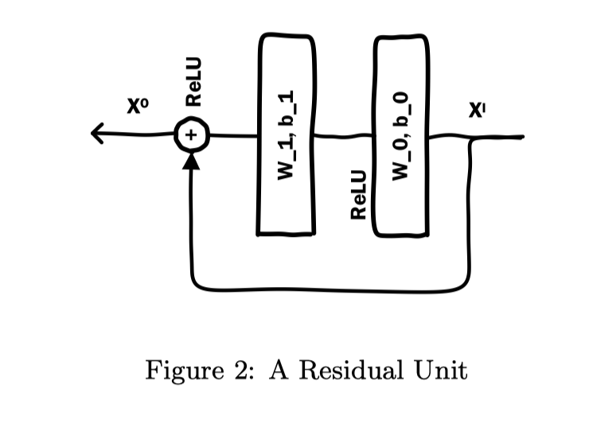
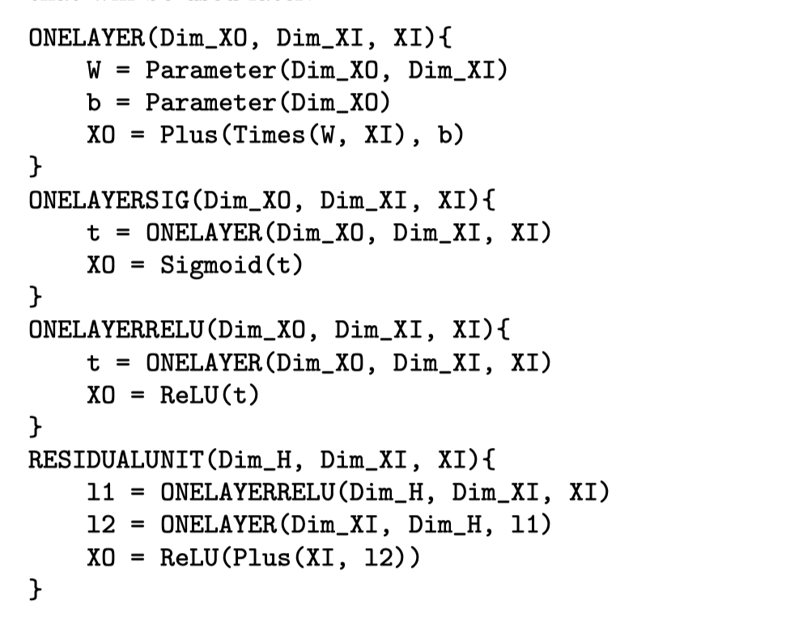
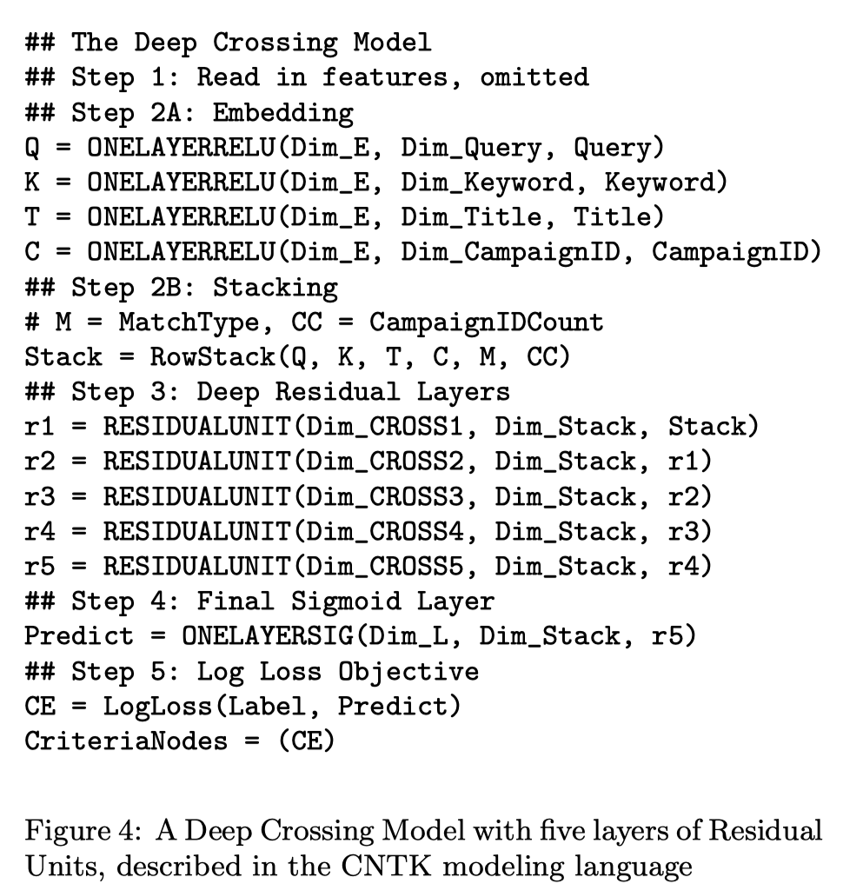

Deep Crossing模型是微软于2016年在KDD上提出的模型，它算是第一个企业以正式论文的形式分享深度学习推荐系统的技术细节的模型。由于手工设计特征（特征工程）花费巨大精力，因此文章提出了Deep Crossing模型自动联合特征与特征交叉。以现在的角度看待这个模型是非常简单的，也就是Embedding+MLP的结构，但对当时影响是非常巨大。由于距离Deep Crosssing的提出已过去近4年，因此并不在涉及Introduction和Related Work两部分内容。但该模型的应用场景与之前的电商平台有所不同，因此需要简单提一下。


### 应用场景

Deep Crossing模型的应用场景是微软的搜索引擎Bing中的搜索广告的推荐场景，即文章提到的Sponsored search（赞助搜索）。当用户在搜索引擎中输入搜索词时，除了返回对应的搜索结果，还会有与搜索词相关的广告。这与之前单纯的电商场景不同，因为有搜索的关键词，那么推送给用户的广告将更为精确。如何提高广告的点击率以及转化率，这是Deep Crossing模型的优化目标。


### 模型特征

针对特定的应用背景，微软使用的特征如下：

- Query（搜索）：用户搜索的关键词；
- Keyword（广告关键词）：广告商对自己的产品广告打的标签，用于匹配用户的搜索词；
- Title（标题）：广告的标题；
- Landing Page（落地网页）：点击广告后跳转的网页；
- Match Type（匹配类型）：广告商可选择的关键字与用户查询的匹配程度，通常有四种：精确匹配、短语匹配、宽泛匹配和上下文相关匹配；
- Campaign（广告计划）：广告商投放的计划；
- Imression（曝光样例）：记录了该广告实际曝光场景的相关信息；
- Click（点击样例）：记录了该广告实际点击场景的相关信息；
- Click Through Rate（点击率）：广告的历史点击率
- click prediction（预估点击率）：另一个CTR模型的预估值；

文章给出了如下一个单独特征类型以及维度的例子：



对于搜索词、关键词、文本则是一个文本信息，关于维度信息，在2013年微软提出DSSM模型的论文有所提及。MatchType对应着四个匹配的类型，为分类输入特征。CampaignID使用one-hot编码进行表示。CampaignIDCount是数值特征（**计数型特征**），存储每个活动的统计数据，如点击率、预估点击率等。**所有引入的特征都是稀疏特征，除了计数特征。**


### 模型结构

Deep Crossing模型是一个端到端的模型，结构如下所示，



主要包含4层结构：Embedding层、Stacking层、Multiple Residual Units层和Scoring层。


#### Embedding层

几乎所有基于深度学习的推荐、CTR预估模型都离不开Embedding层，它的作用是将离散高维的稀疏特征转化为低维的密集型特征。Embedding矩阵的参数通过神经网络的反向传播进行训练。在模型结构中发现Feature #2并没有使用Embedding，因为文章提到“维度小于256的特征“不需要进行Embedding转化。


#### Stacking层

Stacking层的工作特别简单，就是将所有的Embedding向量、未进行Embedding操作的原生特征进行拼接。


#### Multiple Residual Units层

Deep Crossing模型中的Crossing就是多个残差单元层来实现。该层使用了残差网络的基本单元，单个残差单元如下所示：



Deep Crossing模型使用稍微修改过的残余单元，它不使用卷积内核，改为了两层神经网络。我们可以看到，残差单元是通过两层ReLU变换再将原输入特征加回来：
$$
X^{O}=\mathcal{F}\left(X^{I},\left\{\mathbf{W}_{0}, \mathbf{W}_{1}\right\},\left\{\mathbf{b}_{0}, \mathbf{b}_{1}\right\}\right)+X^{I}
$$
其中，$W_{\{0,1\}},b_{\{0,1\}}$表示两层的参数，$\mathcal F$表示一个映射函数，将$X^I$映射到$X^O$。我们可以发现$\mathcal F(\cdot)$拟合的是一个残差$X^O-X^I$，这便是残差单元命名的原因。

多个残差单元层是MLP的具体实现，该层通过多个残差单元，对特征向量各个维度进行交叉组合，使模型获得了更多的非线性特征和组合特征信息，进而提高了模型的表达能力。


#### Scoring层

Scoring层就是输出层。对于CTR预估模型，往往是一个二分类问题，因此采用逻辑回归来对点击进行预测。


#### 损失

目标函数是一个对数损失：
$$
\text {logloss}=-\frac{1}{N} \sum_{i}^{N}\left(y_{i} \log \left(p_{i}\right)+\left(1-y_{i}\right) \log \left(1-p_{i}\right)\right)
$$
其中$y_i$表示真实的标签（点击或未点击），$p_i$表示Scoring层输出的结果。


#### Deep Crosssing框架

关于残差单元，文章使用的不是卷集核，为了保证$XO、XI$最后的维度相同，残差块**最后一层的隐藏单元为输入的维度**，如下所示：



论文中模型的实现通过Computational Network Tool Kit (CNTK)，框架图如下：



对于上述的Dim_E、Dim_Cross[1-5]，文章使用了256、512、512、256、128、64隐藏单元。Dim_Stack表示Stack的维度，各个稀疏特征的Embedding维度相同。


### 代码复现

该模型的复现比较简单，但是文章中的数据集好像没有公开，因此我们依旧使用Criteo数据集进行实验。

文章中的残差单元：

```python
class Residual_Units(Layer):
    """
    Residual Units
    """
    def __init__(self, hidden_unit, dim_stack):
        """
        :param hidden_unit: the dimension of cross layer unit
        :param dim_stack: the dimension of inputs unit
        """
        super(Residual_Units, self).__init__()
        self.layer1 = Dense(units=hidden_unit, activation='relu')
        self.layer2 = Dense(units=dim_stack)
        self.relu = ReLU()

    def call(self, inputs):
        x = inputs
        x = self.layer1(x)
        x = self.layer2(x)
        outputs = self.relu(x + i)
```

完整代码Github地址：https://github.com/BlackSpaceGZY/Recommended-System


